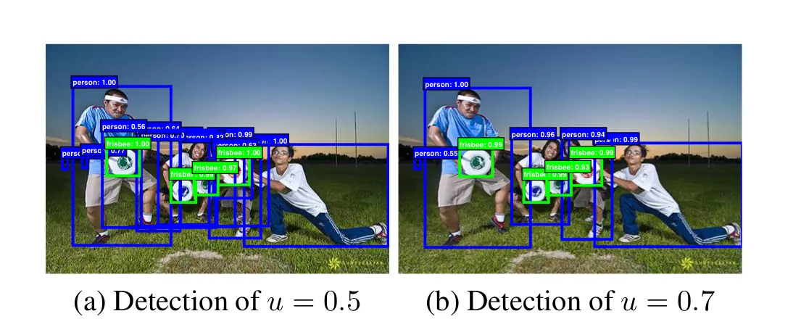
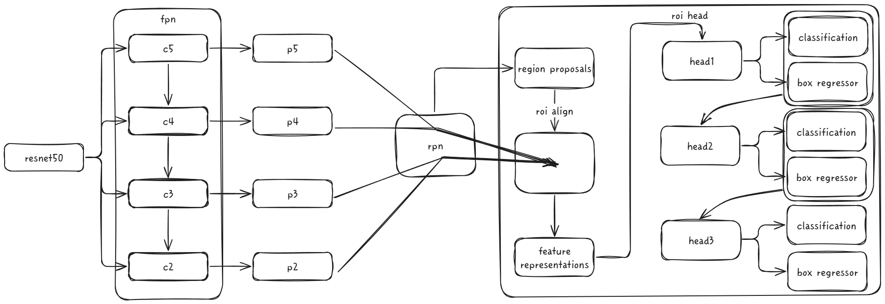

# cascade r-cnn


<aside>

🔥**Prerequisite: faster r-cnn**

</aside>

# 1. Overview

- 기존의 *object detector*는 *IoU*의 *threshold*를 0.5로 고정하여 설정하는데 이건 느슨한 조건이다.



- 왼쪽은 느슨한 조건으로 인해 *positive box*에 노이즈가 많이 낀 상태로 학습되어 *false positive*가 높은 상황이다.
- 반면 오른쪽은 적은 *close false positive*를 출력하고 높은 수준의 결과를 보여준다.

- 어떤 하나의 *detector*는 하나의 *IoU threshold **u***에 의해 최적화 된다.
- 하지만, 높은 성능의 *detection*은 *detector*와 *hypothesis*간의 최적의 *matching*을 필요로 한다.
- 단순 ***u***값을 높이는 것은 오히려 성능 저하를 야기한다. *→ overfitting*

- 위의 생각을 정리하여 제안한 내용이 순차적으로 단계를 거치며 *close false positive*에 강인하게 만들자는 것이다.
- *cascade r-cnn*은 이전 단계 헤드의 출력을 다음 단계 헤드로 보내 순차적으로 학습을 시킨다.
- 각 헤드는 순차적으로 높은 ***u***를 가지며, 낮은 ***u***로 학습된 출력을 ***resampling***하여 더 높은 ***u***의 입력으로 사용하면 더 좋은 분포일 것이라는 가설이 들어있다.

## 2. MMDetection cascade r-cnn


- 프로젝트를 진행하며 수도 없이 봤던 *cascare r-cnn*의 *config* 파일을 뜯어보자.
- 아래 내용은 *cascade r-cnn*(*resnet50 + fpn*) 기준으로 설명한다.
    - [깃허브 링크](https://github.com/open-mmlab/mmdetection/blob/main/configs/_base_/models/cascade-rcnn_r50_fpn.py)



### 2-1. backbone

---

```python
# cascade rcnn backbone resnet50
model = dict(
    backbone=dict(
        type='ResNet',
        depth=50,
        num_stages=4,
        out_indices=(0, 1, 2, 3),
        frozen_stages=1,
        norm_cfg=dict(type='BN', requires_grad=True),
        norm_eval=True,
        style='pytorch',
        init_cfg=dict(type='Pretrained', checkpoint='torchvision://resnet50')
        ))
```

- *resnet50*은 각 *stage*의 *feature map* 채널이 [256, 512, 1024, 2048]이다.
- *receptive field* 관점에서 보면 *c2*는 국소적인 정보를 담고 있다. → 작은 객체 탐지에 유리할 수 있음
- 반면 *c5*는 전역적인 정보를 담고 있다. → 큰 객체 탐지에 유리할 수 있음

- ***out_indices***는 백본의 출력할 *stage*의 *index* 정보라고 해석했다.
- 해당 정보를 (0, 1, 2, 3)으로 두면 (*c2, c3, c4, c5*)를 출력하겠다는 의미이고, *backbone* 종류에 따라 출력하는 스테이지와 채널의 매핑 값이 다르므로 주의해야한다.

- ***init_cfg***를 통해 초기화 관련 설정을 할 수 있다.
- 위의 코드에선 *torchvision*의 *resnet50* 가중치를 가져와 사용한다.
- *mmdetection 3.x* 버전에서는 *mmpretrain, 2.x* 버전에서는 *mmcls*를 *import*하여 가져올 수 있다. (해당 방법은 {다음 문서}를 확인)

### 2-2. neck

---

```python
# cascade rcnn neck fpn
model=dict(
		neck=dict(
		        type='FPN',
		        in_channels=[256, 512, 1024, 2048],
		        out_channels=256,
		        num_outs=5)
        )
```

- *backbone*에서 출력된 각 스테이지의 *feature map*은 *neck*에서 강화된다.
- *bottom-up* 방향으로 고차원의 *feature map*을 추출했으니, *top-down* 방향으로 고차원의 정보를 전파한다.

- ***in_channels***는 백본의 출력 채널과 동일해야한다.

> 여기서 의문점이 ***num_outs***의 값이 4가 아닌 5라는 점이다.
*(c2, c3, c4, c5)*를 통해 4개의 feature map을 representation하는 것은 이해할 수 있는데
추가로 1개의 feature map이 생성된다. *c5*를 기반으로 1개의 *extra output*을 생성한다고 한다.
> 

### 2-3. rpn

---

```python
# cascade rcnn rpn
model=dict(
		rpn_head=dict(
		        type='RPNHead',
		        in_channels=256,
		        feat_channels=256,
		        anchor_generator=dict(
		            type='AnchorGenerator',
		            scales=[8],
		            ratios=[0.5, 1.0, 2.0],
		            strides=[4, 8, 16, 32, 64]),
		        bbox_coder=dict(
		            type='DeltaXYWHBBoxCoder',
		            target_means=[.0, .0, .0, .0],
		            target_stds=[1.0, 1.0, 1.0, 1.0]),
		        loss_cls=dict(
		            type='CrossEntropyLoss', use_sigmoid=True, loss_weight=1.0),
		        loss_bbox=dict(type='SmoothL1Loss', beta=1.0 / 9.0, loss_weight=1.0)),
		        )
```

- *neck*에 의해 *representation*된 *feature map*을 토대로 *rpn*은 *region proposals*를 생성한다.

- ***feat_channels***는 *rpn*내부에서 사용하는 *feature map*의 채널 수로 보통 입력 채널 수와 동일하게 설정한다.
- ***anchor generator***는 앵커 생성 모듈이다.
    - *scales*는 생성할 앵커의 크기를 정의하고, 8x8 픽셀을 기본 형태로 사용한다는 것을 의미한다.
    - *ratios*는 너비와 높이의 비율을 설정한다.
    - *strides*는 앵커 생성 위치 스텝을 의미한다.
- ***bbox_coder***는 바운딩 박스를 인코딩하고 디코딩하는 모듈이다.
    - *target_means*는 중심 좌표와 크기의 평균 값을 정의한다.
    - *target_stds*는 박스의 표준편차를 정의하는 것으로 보수적으로 또는 자유롭게 예측할 지에 대한 설정 값이다.

- 그림에는 따로 표현을 못했는데 *rpn*도 학습된다.
- *roi_head*와 마찬가지로 *cls, bbox*에 대한 손실 함수를 두고 더 정교한 *region proposals*를 생성하도록 학습되는 형태이다.

### 2-4. roi head

---

```python
# cascade rcnn roi head
model=dict(
		roi_head=dict(
		        type='CascadeRoIHead',
		        num_stages=3,
		        stage_loss_weights=[1, 0.5, 0.25],
		        bbox_roi_extractor=dict(
		            type='SingleRoIExtractor',
		            roi_layer=dict(type='RoIAlign', output_size=7, sampling_ratio=0),
		            out_channels=256,
		            featmap_strides=[4, 8, 16, 32]),
		        bbox_head=[
		            dict(
		                type='Shared2FCBBoxHead',
		                in_channels=256,
		                fc_out_channels=1024,
		                roi_feat_size=7,
		                num_classes=80,
		                bbox_coder=dict(
		                    type='DeltaXYWHBBoxCoder',
		                    target_means=[0., 0., 0., 0.],
		                    target_stds=[0.1, 0.1, 0.2, 0.2]),
		                reg_class_agnostic=True,
		                loss_cls=dict(
		                    type='CrossEntropyLoss',
		                    use_sigmoid=False,
		                    loss_weight=1.0),
		                loss_bbox=dict(type='SmoothL1Loss', beta=1.0,
		                               loss_weight=1.0)),
		            dict(
		                type='Shared2FCBBoxHead',
		                in_channels=256,
		                fc_out_channels=1024,
		                roi_feat_size=7,
		                num_classes=80,
		                bbox_coder=dict(
		                    type='DeltaXYWHBBoxCoder',
		                    target_means=[0., 0., 0., 0.],
		                    target_stds=[0.05, 0.05, 0.1, 0.1]),
		                reg_class_agnostic=True,
		                loss_cls=dict(
		                    type='CrossEntropyLoss',
		                    use_sigmoid=False,
		                    loss_weight=1.0),
		                loss_bbox=dict(type='SmoothL1Loss', beta=1.0,
		                               loss_weight=1.0)),
		            dict(
		                type='Shared2FCBBoxHead',
		                in_channels=256,
		                fc_out_channels=1024,
		                roi_feat_size=7,
		                num_classes=80,
		                bbox_coder=dict(
		                    type='DeltaXYWHBBoxCoder',
		                    target_means=[0., 0., 0., 0.],
		                    target_stds=[0.033, 0.033, 0.067, 0.067]),
		                reg_class_agnostic=True,
		                loss_cls=dict(
		                    type='CrossEntropyLoss',
		                    use_sigmoid=False,
		                    loss_weight=1.0),
		                loss_bbox=dict(type='SmoothL1Loss', beta=1.0, loss_weight=1.0))
		        ]),
        )
```

- 먼저 *roi head*는 *rpn*이 예측한 *region proposals*를 크기 기준으로 적합한 스테이지에 *roi align*을 통해 *feature map*을 *representation*한다.
    - 정확히는 *region proposals*를 *representation* 하는 것으로 이해했다.
    - 크기가 작은 박스는 저수준의 스테이지에 *align*하여 *representation*한다.
    - 크기가 비교적 큰 박스는 고수준의 스테이지에 *align*하여 *representation*한다.
- 코드의 *roi align* 부분을 보면, *align*하여 새롭게 *representations*된 *region proposals*는 7x7x256 고정된 형태로 출력 됨을 알 수 있다.

- 이후 해당 정보는 *head1*에 입력되어 *classifiaction, bbox regression*이 이루어진다.
- 또, head1에서 예측한 정보는 head2에서 활용되는 방식으로 앞서 언급한 순차적인 단계를 거치는 것이다.

- 좀 더 자세히 보면, *bbox_head*의 *bbox_coder*의 *target_stds*값이 단계 별로 상이하다는 것을 알 수 있다.
- 해당 값을 점차 낮추면서, 단계가 거듭 됨에 따라 좀 더 보수적으로 예측하게 설정한 것으로 해석했다.

- 공식 깃허브의 ***train_cfg***에 *rcnn* 관련 ***iou threshold***를 지정하는 부분이 있다.
- *threshold*를 단계 별로 점차 높이며 이전에 느슨한 기준의 예측 값을 토대로 더 정교한 예측을 하는 구조로 구성되어 있다는 것을 확인할 수 있다.